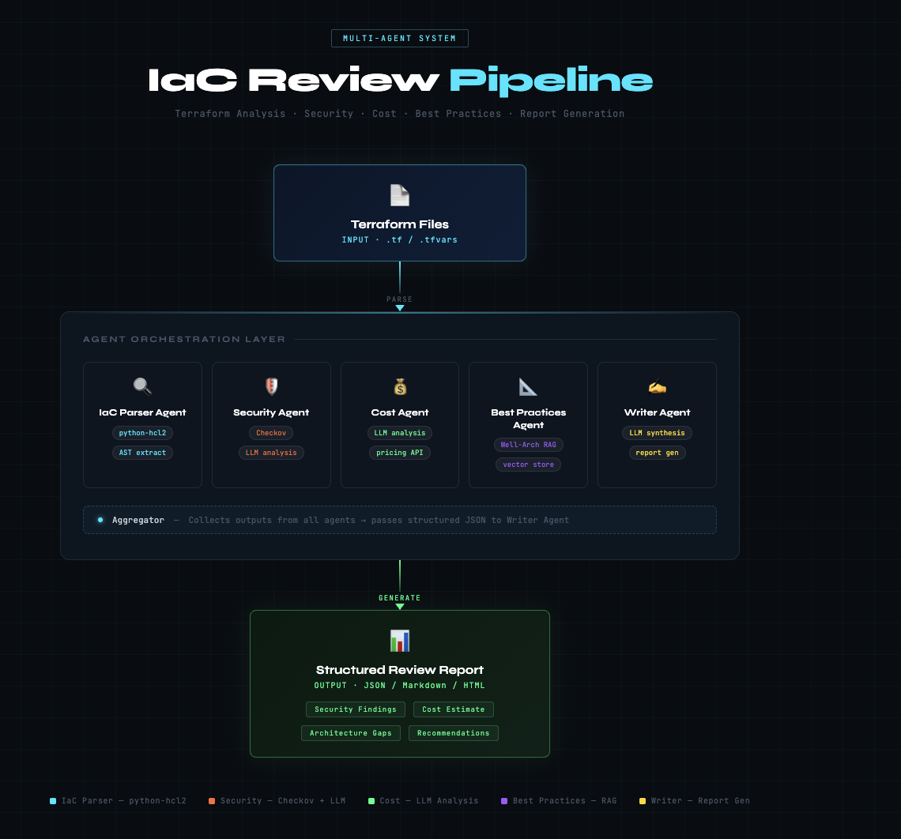

# 🏗️ Terraform AI Reviewer

> **Multi-Agent AI system that automatically reviews Terraform infrastructure for security vulnerabilities, cost optimization, and AWS Well-Architected best practices.**



[](https://python.org)
[](https://langchain-ai.github.io/langgraph/)
[](https://streamlit.io)
[](LICENSE)

---

## 🎯 What It Does

Upload any Terraform (`.tf`) files → **5 specialized AI agents** analyze your infrastructure in parallel → get a structured review report with security risks, cost breakdowns, and actionable fixes — in under 60 seconds.

This project mirrors real-world cloud architecture review workflows used at AWS, but fully automated with AI.

---

## 🏛️ Architecture

```
Input: Terraform (.tf files)
              ↓
    ┌─────────────────────────────────────────┐
    │           Orchestrator (LangGraph)       │
    │                                         │
    │  🔍 IaC Parser Agent                    │
    │       └── python-hcl2                   │
    │                                         │
    │  🔐 Security Agent                      │
    │       └── Checkov + LLM analysis        │
    │                                         │
    │  💰 Cost Agent                          │
    │       └── LLM cost estimation           │
    │                                         │
    │  📋 Best Practices Agent                │
    │       └── Well-Architected RAG          │
    │                                         │
    │  ✍️  Writer Agent                       │
    │       └── Final report compiler         │
    └─────────────────────────────────────────┘
              ↓
    Output: Structured Review Report
```

---

## ✨ Features

- **🤖 5 Specialized Agents** — each agent focuses on one domain (security, cost, best practices, parsing, writing)
- **🔐 Security Scanning** — powered by Checkov, detects 1000+ misconfigurations
- **💰 Cost Analysis** — estimates monthly AWS spend and suggests right-sizing
- **📋 Well-Architected Review** — covers all 6 pillars (Security, Reliability, Cost, Performance, Operations, Sustainability)
- **🧠 RAG Grounded** — responses grounded in AWS documentation, not hallucinated
- **💾 Persistent Memory** — remembers org conventions and team preferences via Mem0
- **⬇️ Downloadable Reports** — export full review as Markdown
- **🌐 Web UI** — clean Streamlit interface, upload any `.tf` file

---

## 🛠️ Tech Stack

| Layer | Technology |
|---|---|
| **Agents** | LangGraph |
| **LLM** | Qwen 3 Coder (via UncloseAI — free) |
| **RAG** | LlamaIndex + ChromaDB |
| **Memory** | Mem0 |
| **MCP Server** | FastAPI |
| **Security Scanner** | Checkov |
| **IaC Parser** | python-hcl2 |
| **Frontend** | Streamlit |

---

## 🚀 Quick Start

### 1. Clone the repo
```bash
git clone https://github.com/ananya101001/terraform-ai-reviewer.git
cd terraform-ai-reviewer
```

### 2. Create virtual environment
```bash
python3 -m venv venv
source venv/bin/activate
```

### 3. Install dependencies
```bash
pip install -r requirements.txt
```

### 4. Configure environment
```bash
cp .env.example .env
```

Fill in `.env`:
```env
UNCLOSEAI_API_KEY=free
UNCLOSEAI_BASE_URL=https://qwen.ai.unturf.com/v1
LLM_MODEL=hf.co/unsloth/Qwen3-Coder-30B-A3B-Instruct-GGUF:Q4_K_M
MEM0_API_KEY=your_mem0_key
```

### 5. Run the app
```bash
python -m streamlit run frontend/app.py
```

Open `http://localhost:8501` and click **"Run on Sample Terraform"** 🎉

---

## 📸 Demo

### Sample Output
The sample Terraform file contains **6 intentional issues** for demo purposes:

| Issue | Type | Severity |
|---|---|---|
| S3 bucket with public ACL | Security | 🔴 Critical |
| Hardcoded password in RDS | Security | 🔴 Critical |
| Wildcard IAM permissions (`*`) | Security | 🔴 Critical |
| RDS `db.r5.4xlarge` oversized | Cost | 🟡 High |
| No multi-AZ on production DB | Reliability | 🟡 High |
| EC2 monitoring disabled | Operations | 🟢 Medium |

---

## 📁 Project Structure

```
terraform-ai-reviewer/
├── agents/
│   └── graph.py              # LangGraph 5-agent workflow
├── tools/
│   ├── llm_config.py         # UncloseAI/Qwen LLM connection
│   ├── iac_parser.py         # Terraform .tf file parser
│   └── security_scanner.py   # Checkov security scanner wrapper
├── rag/                      # RAG pipeline (Week 2)
├── memory/                   # Mem0 memory layer (Week 3)
├── mcp_server/               # FastAPI MCP server (Week 3)
├── frontend/
│   └── app.py                # Streamlit UI
├── sample_terraform/
│   └── main.tf               # Demo file with intentional issues
├── assets/
│   └── architecture.png      # Architecture diagram
├── requirements.txt
└── .env.example
```

---

## 🗺️ Roadmap

- [x] Week 1 — Multi-agent workflow (LangGraph)
- [x] Week 1 — IaC Parser, Security, Cost, Best Practices agents
- [x] Week 1 — Streamlit UI + Streamlit Cloud deployment
- [ ] Week 2 — RAG pipeline (AWS Well-Architected Framework docs)
- [ ] Week 3 — MCP Server (FastAPI tools)
- [ ] Week 4 — Mem0 persistent memory + GitHub PR integration

---

## 🔑 API Keys

| Service | Link | Cost |
|---|---|---|
| UncloseAI (Qwen LLM) | [uncloseai.com](https://uncloseai.com) | **Free** |
| Mem0 (Memory) | [mem0.ai](https://mem0.ai) | Free tier |

---

## 🤝 Inspired By

This project is inspired by real-world Multi-Agent GenAI workflows used in production cloud engineering — combining **RAG grounding**, **MCP tool servers**, and **persistent memory** to build reliable, hallucination-resistant AI systems.

---

## 📄 License

MIT License — free to use, modify, and distribute.

---

<p align="center">Built with ❤️ using LangGraph + Qwen + Checkov</p>
